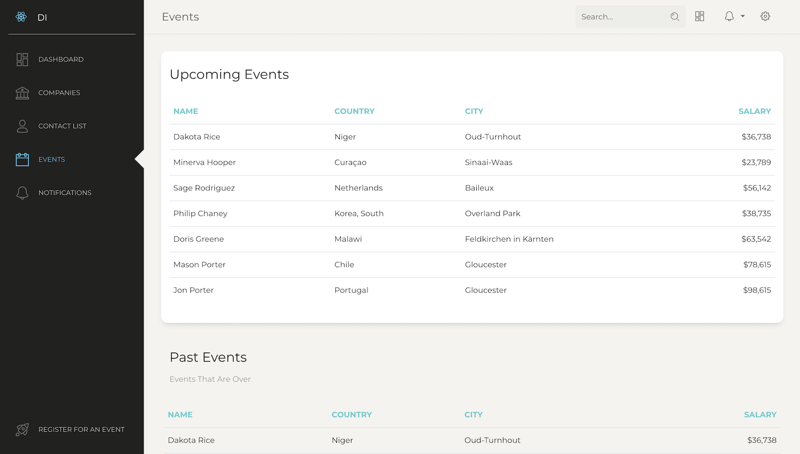

## Project Overview

Key Terms:
React
PostgreSQL
AWS
Serverless

This project is concerned about three interrelated types of data:
Companies that belong to the firm
Contacts that work for member firms and/or attend firm events
Events for discussing various topics that interest architecture, engineering, and construction firms.

Internally, the data is stored in a relational database running on AWS's RDF api which provides the open source PostgreSQL database as a fully managed service. The application is deployed with Vercel, which provides a serverlees interface to RDF.

Basic navigation is from a list of Companies, Events, or Contacts, depending on the user's initial interest. Once a selection is made, the user is presented a page. For example if the user selects TeslaX from the company listing, the user will be taken to a page dedicated to TeslaX.
Pages for major entities -- Companies, Events, Contacts are organized into a set of panels with each panel focusing on some aspect of the entity. 
For example, the company page contains 3 panels: One showing details about company location, line of business, and key officers. A second showing simplified information about Events employees of the firm have attended. A third showing key information about an event (name, location, date). 
Likewise, the event page shows detailed information about the event and simplified data about Companies and Contacts.

Whenever a reference to any entity shows up on any page, the name of the entity is turned into an HTML link. This allows near instant navigation from a specific company, to an event attended by one of its employees, to all that companies employees who attended and then to details about the employee.

Internally, the API to the database organizes information in the same way -- a style associated with GraphQL -- so that a developer only needs one request to the server to collect all of the information required for a page and its panels.

The data has been transformed from the efficient relational database structure to more informative graph structure.

## Dashboard

Description of image

## Companies

Description of image

## Contacts

Description of image

## Events

Description of image

## Notifications

Description of image
