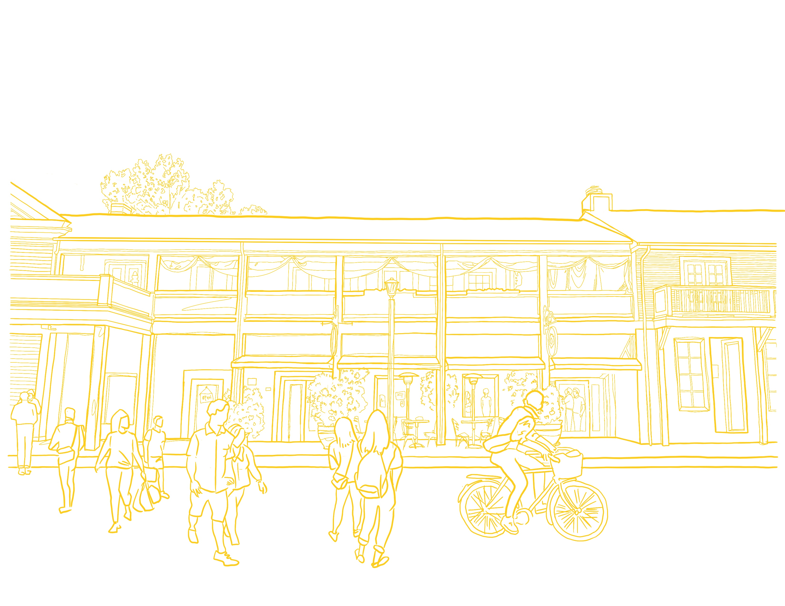
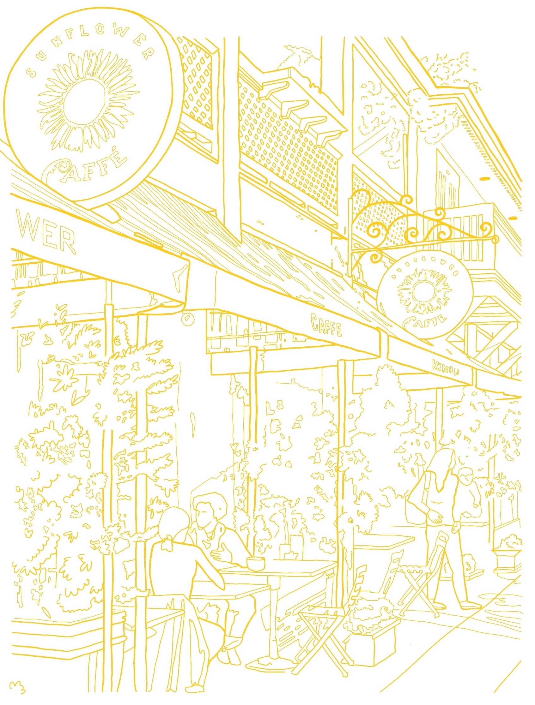
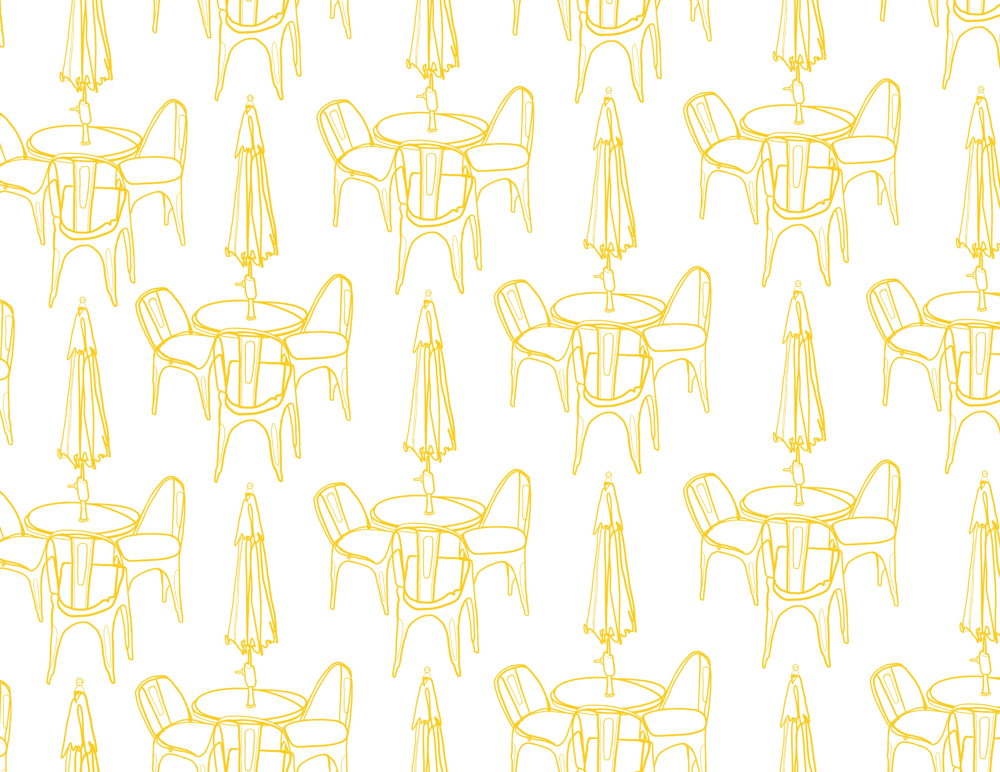
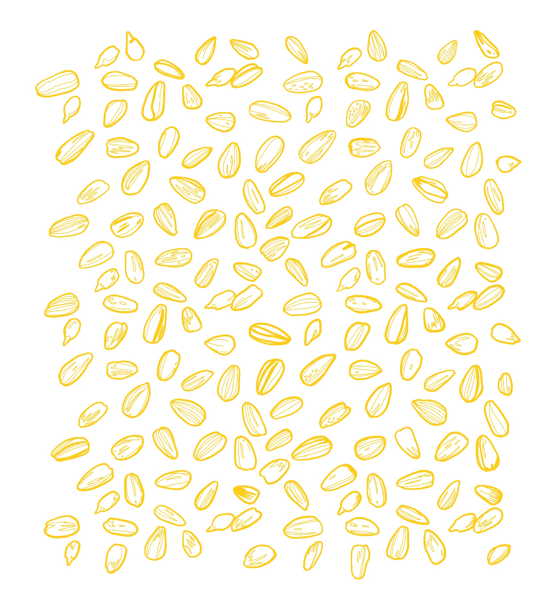
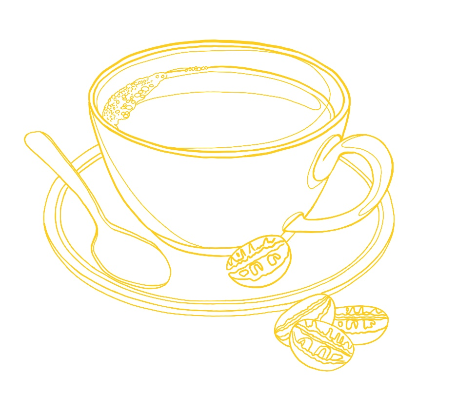
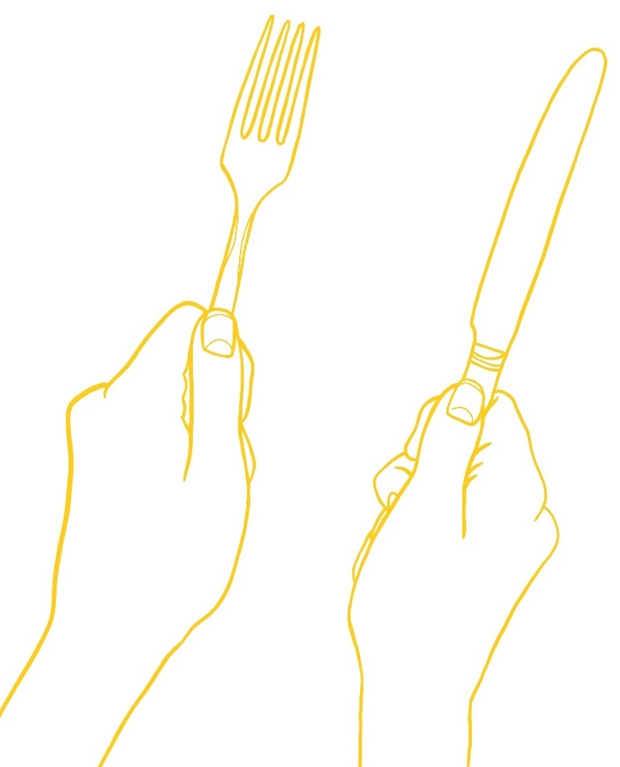

I've now deployed the site on Netlify rather than Github pages. So far so good, seems to perform much quicker.

However, having some css issues when on my mobile device. Even when shrinking the page on the desktop into a size that is equivalent to mobile it looks fine, when on my phone things are jumbled around.

Thinking maybe it's a css prefixer issue (mobile using Safari, desktop using Chrome) though I've been using [Autoprefixer CSS online](https://autoprefixer.github.io/) to quickly parse my CSS to add vendor prefixes. This tool has worked great in the past, but it is not fixing everything on this one.

I've had to completely remove the parallax feature in order to display the hero image properly.

On the plus side:

I've recently realized a big strength of mine-
to be able to use custom illustrations to bring life to some of the websites I have been building on the side, also to add a sort of personal signature and consistent style to each that I do.

<h3>Here are some of those that I've been working on:</h3>

 
  
  
 
 
 

Custom social icons seems to tie everything together instead of using some generic thing like Font Awesome icons.

<h3>Here are some that I've created:</h3>

...Lastly...
If anyone has copyright knowledge that would be appreciated!
