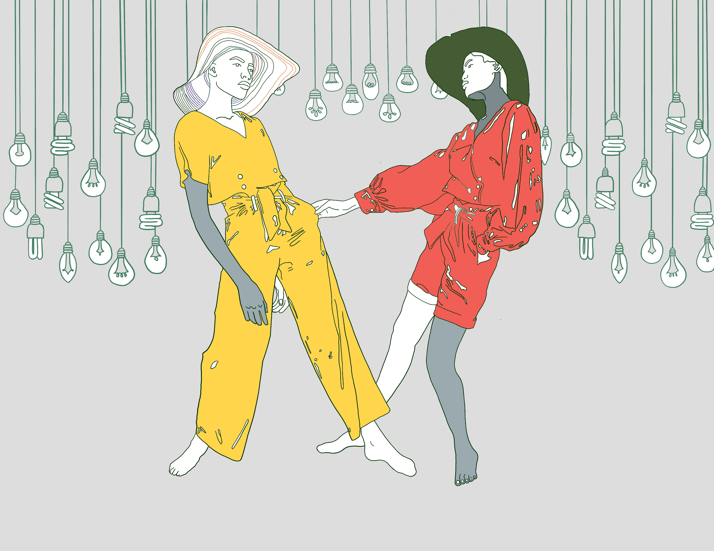
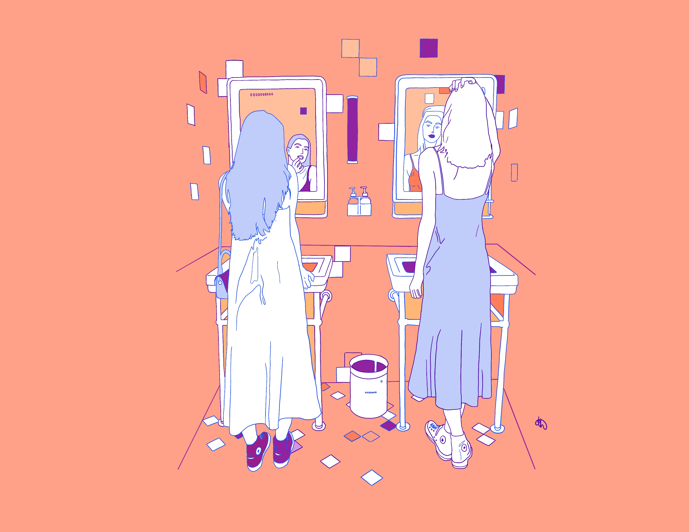
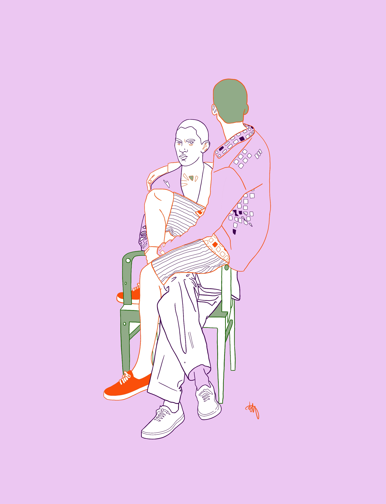
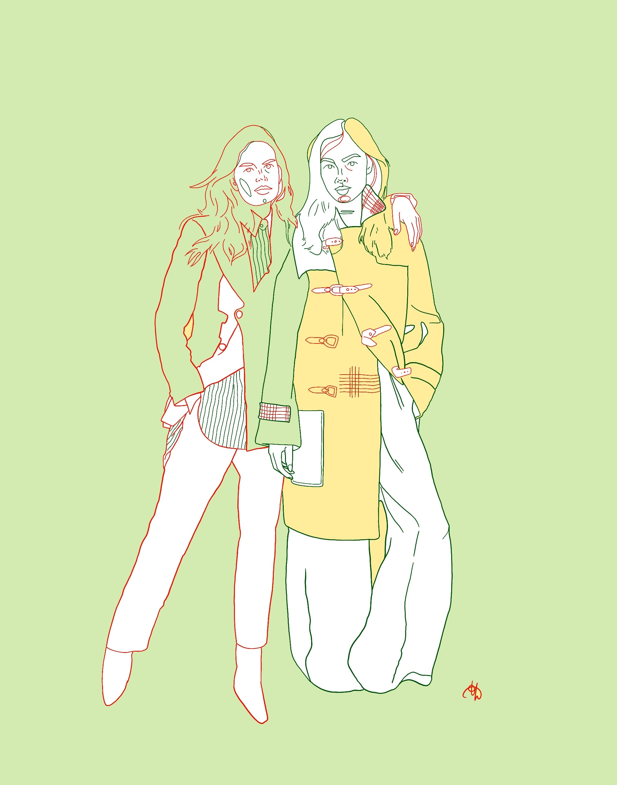

Although it is easy to stay isolated with your eyes glued to the blue screen for 24 hours straight trying to solve some coding issue (with intermediate bursts of shouting trying to reason with the little person living inside of your computer), I find taking a break and working on something other than programming helps being able to think clearly for any consistent duration of time.

My something as of late has been digital illustrations on Procreate. My job luckily gifted me an ipad at the beginning of the year. I've since fallen in love with the tool for both work and personal projects.

<h3>Here are a few of my illustrations that I've done in the last week or so:</h3>

Since I was a youngster I've found human interaction fascinating, which led into portrait sketchings/paintings. Retrospectively thinking, I believe my social anxiety has helped me become extremely perceptive and detail oriented(I've been told I notice things many would not). I would then tweak what I see into freeform quick/short-stroke expressionistic portraits. However, lately I've developed a simple illustrative fine-lined style that I identify with and will keep exploring.

I enjoy digital art for many reasons but the main being no clean up (!!!), access to every tool in the world (wut wut), easy digital documentation (hello social media- if you're into that sort of thing ;)), and consistency (not worrying about varying backgrounds/tools, creating a consistent style and/or series). I've only played around with Procreate thus far, as I've just started getting into digital art, and I find it to be everything I'd need.

Tool recommendations? Interesting photos? Send them my way.

<h3>The series I am currently focusing on consists of:</h3> 

1. two people
2. interesting poses/shapes
3. relational ambiguity
