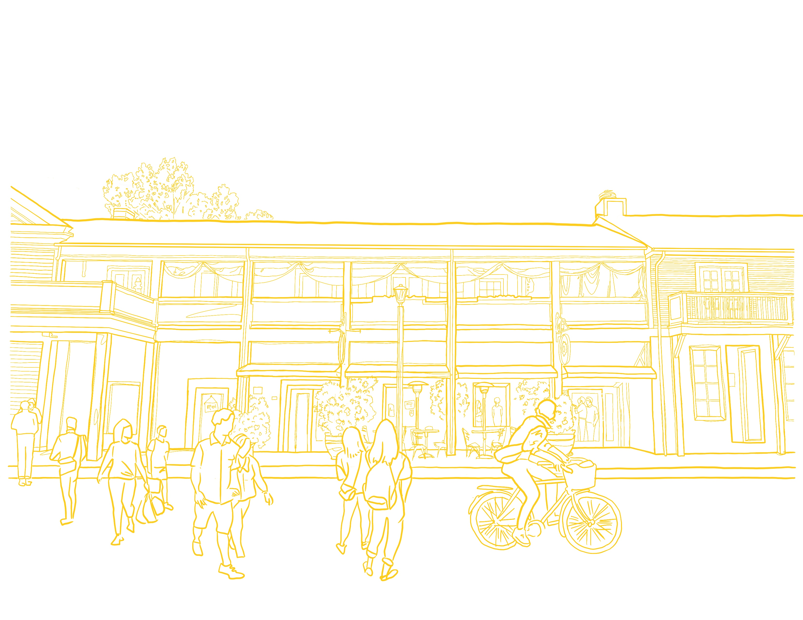
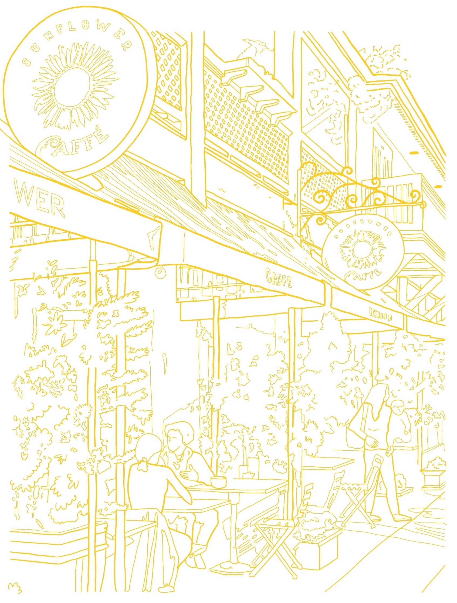
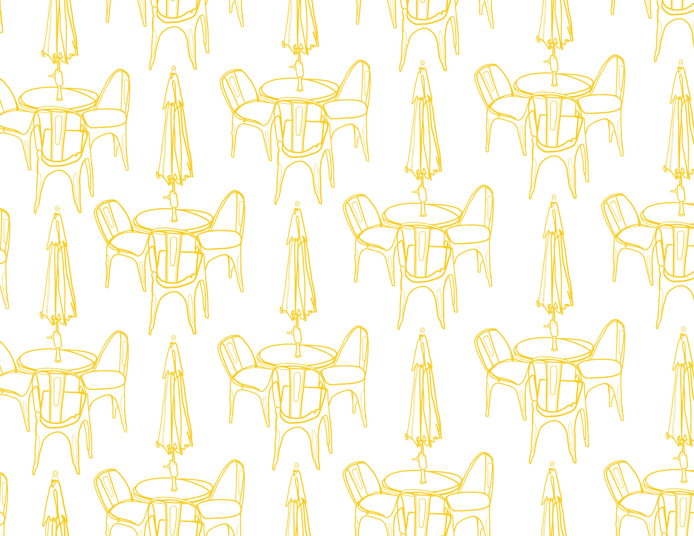
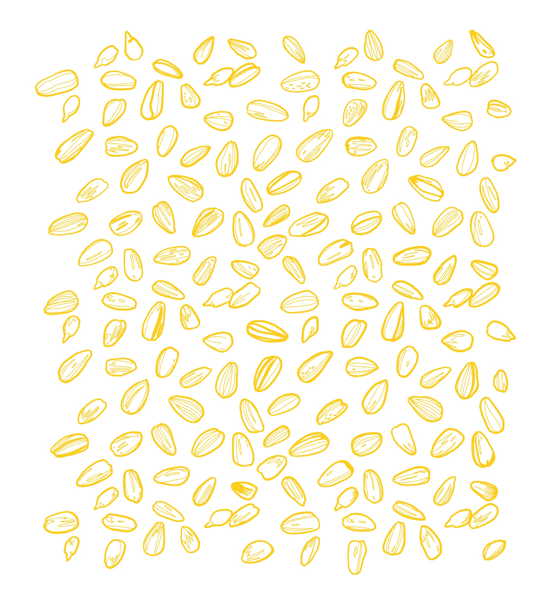
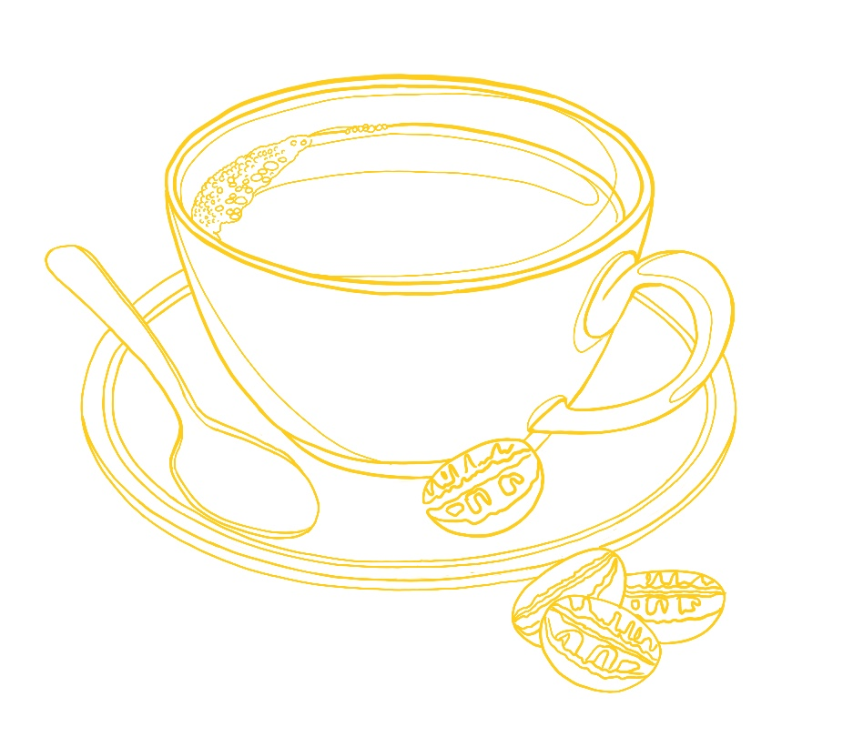
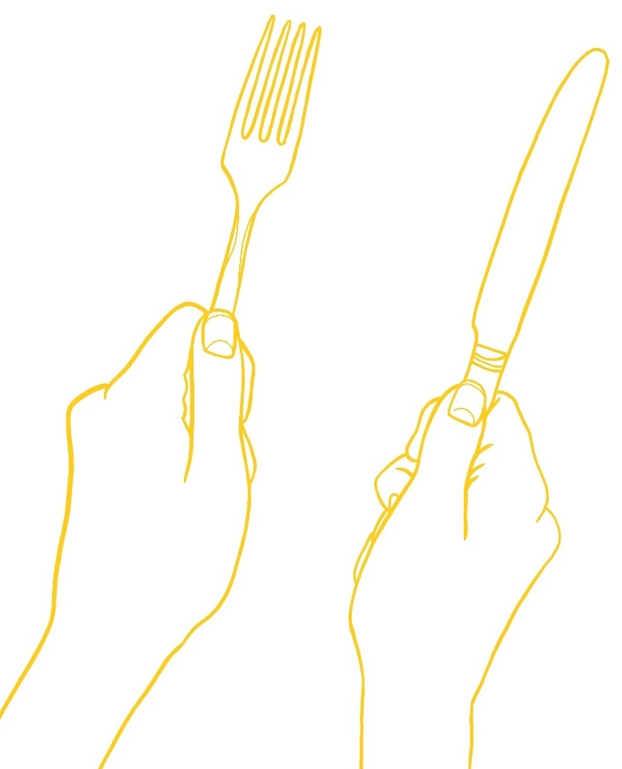

I've now deployed the site on Netlify rather than Github pages. So far so good, seems to perform much quicker.

However, having some issues with CSS when on my mobile device. Even when shrinking the page on the desktop into a size that is equivalent to mobile it looks fine, when on my phone things are jumbled around. iOS Safari issues I suppose.

Thinking maybe it's a css prefixer issue (mobile using Safari, desktop using Chrome) though I've been using [Autoprefixer CSS online](https://autoprefixer.github.io/) to quickly parse my CSS to add vendor prefixes. This tool has worked great in the past, but it is not fixing everything on this one.

I've had to completely remove the parallax feature in order to display the hero image properly.

<h3>On the plus side:</h3>

I've realized using custom illustrations to bring life to websites adds a personal signature and consistent style to each that I do.

<h3>Here are some of those that I've been working on:</h3>

 
  
  
 
 
 

Also excited about the idea of custom social icons to create one cohesive style rather than using premade icons from somewhere online.

<h3>Here are some that I've created:</h3>

